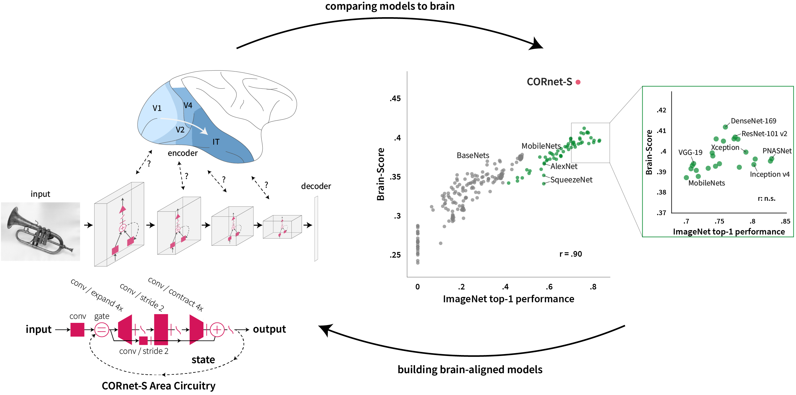

# Brain-Like Object Recognition with High-Performing Shallow Recurrent ANNs

This repository hosts materials for our NeurIPS 2019 publication:

*Kubilius\*, Schrimpf\*, et al. **Brain-Like Object Recognition with High-Performing Shallow Recurrent ANNs.** NeurIPS 2019 (oral)*

\* Equal contribution



This paper brings forward two major contributions:

- Brain-Score, a framework for evaluating models on integrative brain measurements. Brain-Score allows to quantify how similar models are to brain responses (neural and behavioral). The current Brain-Score leaderboard is available at [Brain-Score.org](https://brain-score.org). If you want to score your own model, use the [Brain-Score repo](https://github.com/brain-score/brain-score)
- CORnet-S, a shallow recurrent artificial neural network that is the current best model on Brain-Score. A PyTorch version of ImageNet pre-trained is available at [CORnet repo](https://github.com/dicarlolab/cornet).


Please cite this work as follows:

```
@inproceedings{KubiliusSchrimpf2019neurips,
  title={Brain-Like Object Recognition with High-Performing Shallow Recurrent ANNs},
  author={Kubilius, Jonas and Schrimpf, Martin and Kar, Kohitij and Hong, Ha and Majaj, Najib J and Rajalingham, Rishi and Issa, Elias B and Bashivan, Pouya and Prescott-Roy, Jonathan and Schmidt, Kailyn and Nayebi, Aran and Bear, Daniel and Yamins, Daniel L K and DiCarlo, James J},
  booktitle={Advances in Neural Information Processing Systems},
  year={2019}
}
```

# Reproducing the paper

We provide aggregated data sources for reproducing most of the figures in the paper. Run `python figures.py gen_all` in order to generate all figures except Fig. 4 and 5. Data for Fig. 4 involves a comparison of many models; we chose to not package all that data. For Fig. 5, run `python fig4.py prediction_vs_target`, but note that it will be recomputed from scratch and will therefore require multiple dependencies and may take a long time.

The data used in these figures has been computed using older versions of Brain-Score and thus may not perfectly reproduce when using the latest releases. We highly recommend using the latest release of Brain-Score (and the current scores in the leaderboard at [Brain-Score.org](https://brain-score.org)) if you intend to report on your own data or models.
